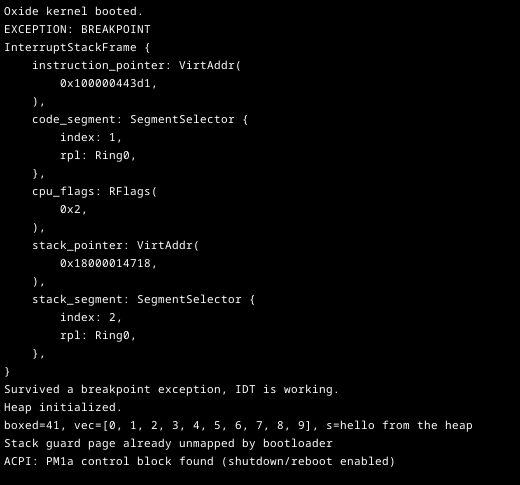
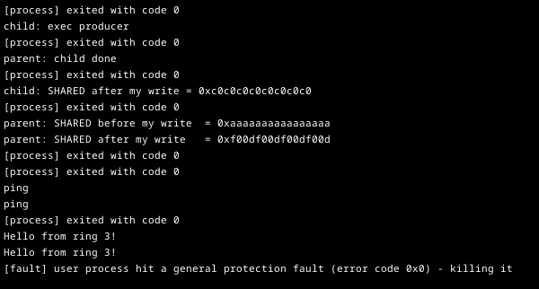
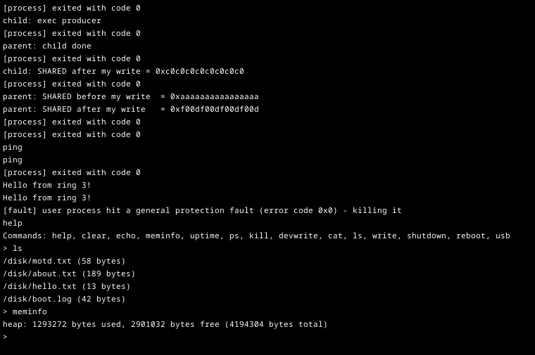

# Oxide

**A preemptive, multi-core x86-64 operating system kernel written from scratch in Rust.**


Oxide implements the core of an operating system without a libc or any
existing kernel code: virtual memory, a multi-core scheduler, a system call
interface, device drivers, a filesystem, and a TCP/IP stack. It boots under
QEMU and provides a text-mode shell.

## Features

**Kernel**
- 4-level x86-64 paging with a private address space per process
- Preemptive scheduling across all CPU cores, using per-core state and a
  shared run queue
- SMP bring-up via INIT-SIPI-SIPI, including a hand-written real-mode to
  long-mode trampoline
- Ring 3 user processes with a `syscall`/`sysretq` interface
- Copy-on-write `fork()`, `exec()`, and pipe-based IPC
- ELF loader with support for position-independent executables
  (`R_X86_64_RELATIVE` relocations)
- ACPI table parsing for CPU discovery, shutdown, and reboot

**Drivers and I/O**
- virtio-blk and virtio-net, implemented directly against the virtio and PCI
  specifications
- UHCI USB host controller with a HID boot-keyboard driver
- Framebuffer text console and serial output

**Storage and networking**
- Persistent on-disk filesystem (OXFS) with create, read, and overwrite; files survive a reboot
- ARP, IPv4, ICMP, UDP, and a TCP state machine

## Screenshots

**Boot.** Each subsystem reports as it initializes. The interrupt frame at the
top is intentional: the kernel triggers a breakpoint exception to verify its
exception handling before continuing.



**Concurrent processes.** Test programs run simultaneously: `fork()` with
copy-on-write (the `SHARED` lines show parent and child each holding a
private copy after a write), a separately compiled Rust binary running in
user mode, and a deliberate privilege violation that the kernel contains by
terminating only the offending process.



**Shell.** Input arrives through the USB HID driver. `help` lists commands,
`ls` reads the on-disk filesystem, and `meminfo` reports heap usage.



## Getting Started

**Prerequisites:** [Rust](https://rustup.rs) (the pinned nightly toolchain is
installed automatically) and [QEMU](https://www.qemu.org/) with
`qemu-system-x86_64` on your `PATH`.

```sh
cargo run --release             # boot via legacy BIOS
cargo run --release -- uefi     # boot via UEFI (OVMF)
```

This builds the kernel and boot image, creates the data disk, and starts
QEMU with a virtio disk, a virtio network card, and a USB keyboard attached.

## Shell Commands

| Command                     | Description                         |
| --------------------------- | ----------------------------------- |
| `help`                      | List all commands                   |
| `ls`                        | List files on disk                  |
| `cat <path>`                | Print a file's contents             |
| `write /disk/<name> <text>` | Create or overwrite a file on disk  |
| `ps`                        | List running tasks                  |
| `kill <id>`                 | Terminate a task                    |
| `meminfo`                   | Show heap usage                     |
| `uptime`                    | Show time since boot                |
| `usb`                       | Show USB root-hub port status       |
| `shutdown` / `reboot`       | Power off or restart via ACPI       |
